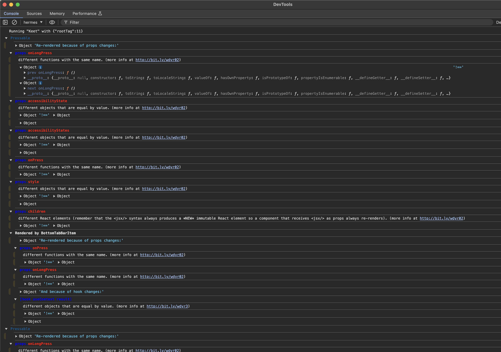

## Overview

This article covers

- Reactotron for redux debugging and custom commands
- react-devtools for UI profiling
- PEAR runtime for core debugging
- Build with Sentry for collect error reports

## Reactotron: Redux debugging and custom commands

> Flipper is deprecated so move the debugging to **Reactotron**.

Download latest Reactotron [Desktop client](https://github.com/infinitered/reactotron/releases?q=reactotron-app&expanded=true/). Run the app in simulator or device, and open the Reactotron desktop client to connect. Timeline tab has all the logs, State tab has the redux connected, and [custom commands](../ReactotronConfig.js#L56) has the useful functions like Creating N rooms, attaching N images, videos, audios and files to chat for populating chat with some random stuffs. Follow the description inside of the Reactotron for how to use the custom commands.

---

## keet-store: link local version

For keet-store development you can link local repo with `scripts/link_local_keet_store.sh` script

```
Usage: link_local_keet_store.sh [-r|--relative-path VALUE | -p|--path VALUE]

Options:
  -r|--relative-path VALUE   Specify a relative path
  -p|--path VALUE            Specify an absolute path

Examples:
  scripts/link_local_keet_store.sh -r ../keet-store             // relative path
  scripts/link_local_keet_store.sh -p /holepunchto/keet-store   // absolute path
```

---

## react-devtools: UI profiling

For **UI profiling** use `npx react-devtools`

In iOS simulator, Go `Menu > Device > Shake` to open the React Native Dev menu, click `Open Debugger` to see the inspector in `react-devtools`.

---

## PEAR runtime: core debugging

you can start devtools/inspection on a live Keet Mobile instance. You do this using Pear Runtime Desktop together with Chrome.

### In the Keet mobile app

1. Go to the menu
1. Hold “Software” for three seconds
1. Tap the Debug menu
1. Tap “Enable inspector”
1. Copy the key

Somehow send it to yourself on your laptop

### In the Pear Runtime Desktop App

1. run `npm i -g pear` to install the pear command ([nodejs](https://nodejs.org/en) is required)
1. open console and run `pear run pear://runtime` to open the Pear Runtime desktop
1. In Pear Runtime window, click `Developer Tooling`
1. Paste the key into `Paste Pear Inspector Key Here` field (right side), and hit enter
1. Hover the app that appeared, and hit Open In Chrome
1. In Chrome Devtools, hit the Inspect button next to your app

---

## Build with Sentry for collect error reports

By default the Github action [Make a Build](https://github.com/holepunchto/keet-mobile/actions/workflows/build.yml) enabled sentry by default, and can remove sentry from the bundle by uncheck the `Is debug release?` option.
Here's the instruction if you need build manually.

1. run `git apply ./scripts/with_sentry.patch` to apply sentry specific configurations
1. add `ios/sentry.properties` and `android/sentry.properties` with Sentry credentials
1. run `./scripts/setup.sh i` to setup npm dependencies and cocoapods

`sentry.properties` file should indlude:

```
auth.token=$SENTRY_TOKEN
defaults.org=$SENTRY_ORG
defaults.project=$SENTRY_PROJECT
defaults.url=$SENTRY_URL
```

---

## Detect unnecessary re-renders using `why-did-you-render`

1. Uncomment the top `import '.src/wdyr'` in [index.js](/index.js)
2. Using [Hermes Debugger chrome dev tool](https://reactnative.dev/docs/debugging?js-debugger=hermes), inspect the error messages


