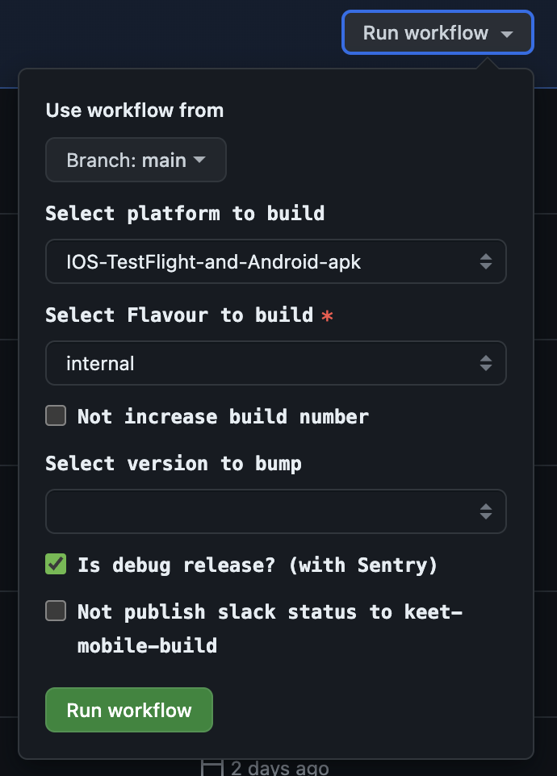
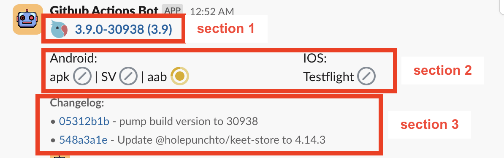
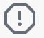
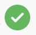

# Github Actions

# [Make build automation](https://github.com/holepunchto/keet-mobile/actions/workflows/build.yml)

Press `Run workflow` on the top right and you will see the next modal:

## Configure build with input fields

### 1. Use workflow from

Dropdown to select base branch which will be used during build automation.

Default: `main`

### 2. Select platform to build

Dropdown to select platforms to build during automation.

Variants:

- `Android-All` Builds Android .apk & .aab & .apk\*SV.
- `Android-apk` Builds Android .apk. The most common Android build format for testing and build sharing without store.
- `Android-aab` Builds Android .aab. Needed for store submission.
- `Android-apk-SV` Builds Android .apk\*sv.
- `IOS-TestFlight` Builds IOS .ipa. Submits IOS .ipa to TestFlight.
- `IOS-TestFlight-and-Android-apk` Builds IOS .ipa and Android .apk. Submits IOS .ipa to TestFlight.
- `All` Builds IOS .ipa and Android .apk & .aab & .apk\*SV. Submits IOS .ipa to TestFlight.
- `<empty>` Can be used to bump build number/version without actual build execution.

Default: `IOS-TestFlight-and-Android-apk`

### 3. Select Flavour to build

Dropdown to select flavor to build during automation.

Variants:

- `prod` [Blue pear] Used for store submission.
- `internal` [Yellow pear] Used for most cases to test newly implemented features, fixed bugs, and debug specific issues.
- `experimental` [Green pear] Used to work with experimental core features which are not accessible with other flavors.

Default: `internal`

### 4. Not increase build number

Checkbox to increase build number by one or not. Build number is defined inside `package.json` file with `buildNumber` property.

Variants:

- `Checked` Does nothing.
- `Not Checked` Increment build number by one => commit changes to repo

Default: `Not Checked`

### 5. Select version to bump

Dropdown to increase version number by one or not. Build version is defined inside `package.json` file with `version` property.

Variants:

- `<empty>` Does nothing
- `major` Incremant major version e.g. 1.0.0 => 2.0.0
- `minor` Incremant minor version e.g. 0.1.0 => 0.2.0
- `patch` Incremant patch version e.g. 0.0.1 => 0.0.2

Default: `<empty>`

### 6. Is debug release? (with Sentry)

Checkbox to include Sentry package or not.

Variants:

- `Checked` Adds Sentry package integration to build. Crashes will be reported to the dashboard. Usually used for `interal` flavor builds for extensive debug.
- `Not Checked` Skipps Sentry package integration. Must be skipped for `prod` flavor!

Default: `Checked`

### 6. Not publish slack status to keet-mobile-build

Checkbox to publish automation status via Slack. Usually used to debug build automation issues to avoid annoying status messages with broken flow.

Variants:

- `Checked` Will publish automation status into `#test-app-deploy` channel.
- `Not Checked` Will publish automation status into `#keet-mobile-build` channel.

Default: `Not Checked`

# Slack build status

During build automation execution we publish current progress via slack in the next way:

### Section 1 is a link to actual build automation with all actual statuses and it has the next format:

<BUILD_FLAVOR_EMOJI><WITH_SENTRY_EMOJI><BUILD_VERSION>-<BUILD_NUMBER>(<BASE_BRANCH>)

`BUILD_FLAVOR_EMOJI` - prod -> blue icon; internal -> yellow icon; experimantal -> green icon;

`WITH_SENTRY_EMOJI` - Displays if Sentry is included in this build. (No Sentry emoji - no Sentry integration).

`BUILD_VERSION` - Build version is defined inside `package.json` file with `version` property. e.g. 3.9.0

`BUILD_FLAVOR_EMOJI` - Generated build number from actual version and `buildNumber` from `package.json` e.g 3.9.0 & 38 => 30938

`BASE_BRANCH` - Selected git base branch during build automation config.

### Section 2 displays actual build statuses. Available statuses:

-  `skipped`
-  `cancelled`
-  `loading`
-  `failed`
-  `successful`

### Section 3 displays the actual changelog based on the git history.

### \*\*Message thread will tag our QAs with the first message. Also sends generated build artifacts like .apk/.aab/.ipa.
