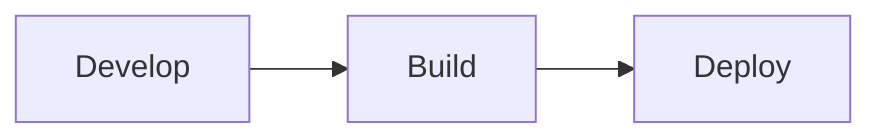
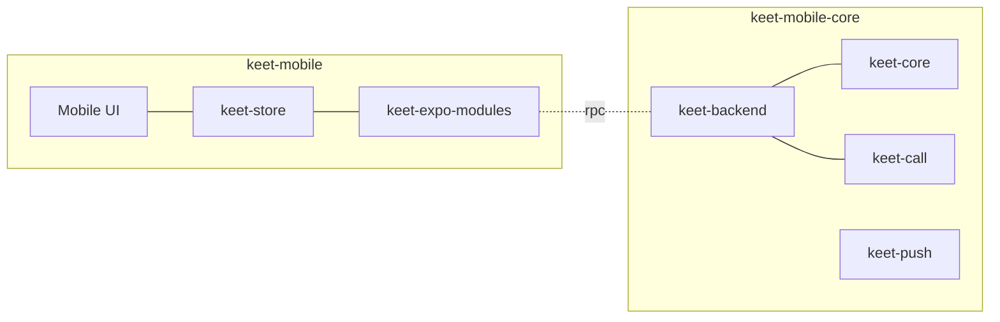
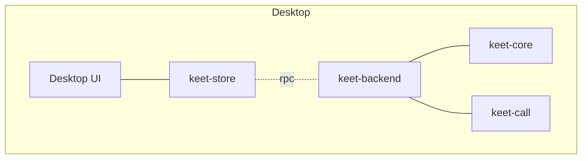

# Overview

The full keet mobile dev cycle can be categorized as 3 phases: Development, Build & Test, Deployment.

## Development

> [!TIP]
> For project setup, read the main [README](https://github.com/holepunchto/keet-mobile).

> [!IMPORTANT]
> Keet-mobile planned tasks are tracked in Asana. Can find [backlogs here](https://app.asana.com/0/1207558849244259/1207562492713303)

### Code Overview

From Desktop or Mobile UI, we use [keet-store](https://github.com/holepunchto/keet-store) to access keet-backend API through RPC.

[keet-backend](https://github.com/holepunchto/keet-backend) contains [keet-core](https://github.com/holepunchto/keet-core/tree/main) for Room, text chat and file transfer functionalities;
[keet-call](https://github.com/holepunchto/keet-call) for Video and Voice call functionalities.

### Mobile flow

[keet-mobile-core](https://github.com/holepunchto/keet-mobile-core/) is a wrapper that integrate the [keet-backend](https://github.com/holepunchto/keet-backend) and push notifications functionalities.
[webrtc](https://github.com/holepunchto/webrtc) is the Expo native module that implements the subset of WebRTC API we need to run calls.
[keet-push](https://github.com/holepunchto/keet-push) is used to handle push notification in app side. [keet-push-gatekeeper](https://github.com/holepunchto/keet-push-gatekeeper) is used to send Keet notifications using FCM in a P2P way.

Inside keet-mobile repo, `/keet-expo-modules` is the Expo native module used to interact with native APIs. Which follows [Expo Modules API: Design considerations](https://docs.expo.dev/modules/design/)

> [!NOTE]
> [keet-mobile](https://github.com/holepunchto/keet-mobile) main branch with the `bigroom` API;
~~The [alpha](https://github.com/holepunchto/keet-mobile/tree/alpha) branch with the `uproom` API (DEPRECATED)~~

### Desktop flow (for reference)

> [!NOTE]
> [keet-desktop](https://github.com/holepunchto/keet-desktop) main branch with the `bigroom` API;

### Keet API Call flow

Take create room for example.

From Mobile UI to create a new Room, UI dispatch the `createRoomSubmit` action from [keet-store](https://github.com/holepunchto/keet-store), which calls `createRoom` RPC

https://github.com/holepunchto/keet-store/blob/main/api/rooms.js#L23-L26

Then the [keet-mobile-core](https://github.com/holepunchto/keet-mobile-core) module intercept the call with `makeMethod(api.core, 'createRoom')` from
https://github.com/holepunchto/keet-mobile-core/blob/main/src/backend.js#L221

Then [keet-core](https://github.com/holepunchto/keet-core) do the actual handling with `this.createRoom = this._createRoom.bind(this)` from
https://github.com/holepunchto/keet-core/blob/main/index.js#L152

----

## DEVELOPMENT

We roughly categorize Keet modules as:

- **ROOM** for Lobby, join/leave room, Room options and member handling
- **CHAT** for User Chat UI, emoji reactions and various messaging types
- **MEDIA & FILE** for File handling, media messages in Chat UI, Media & File screen
- **SYSTEM** for All thing except above modules

#### ROOM

- [LobbyScreen](../src/screen/LobbyScreen) Main screen UI
- [PairingRoomsScreen](../src/screen/PairingRoomsScreen) show room pair status
- [RoomTitle](../src/component/RoomTitle.tsx) the Chat Screen title contains room name, status and some actions buttons.
- [RoomOptions](../src/screen/RoomScreen/RoomOptions) RoomOptions Screen
- [UserProfileScreen](../src/screen/UserProfileScreen) User profile UI to change profile image/name, request DM or block user
- [CreateChannel](../src/screen/CreateChannel) - UI to creat a channel
- [DMRequestScreen](../src/screen/DMRequestsScreen) - UI to request DM connection
- [MyDevicesScreen](../src/screen/MyDevicesScreen) - My Devices handling

#### CHAT

Chat Screen contains several building blocks:

- [ChatInput](../src/screen/RoomScreen/ChatInput) input field and attachment handling
- [ChatEvents](../src/screen/RoomScreen/ChatEvents) messages list
- [ChatEvent](../src/screen/RoomScreen/ChatEvent) display of  various chat event types
- [LongTextPreviewScreen](../src/screen/LongTextPreviewScreen) screen to view long message

Keet used markdown to show content, after 2024/12 keet switched to the new display format (To be documented).

✏️ There are 3 places to render user content:

- [MessagePreview](../src/component/MessagePreview.tsx) to show the preview message in lobby and in message notification.
- [PinnedMessageHeader](../src/screen/RoomScreen/Pinned/PinnedMessageHeader.tsx) to show the pinned message in room
- [ChatEventMessage](../src/screen/RoomScreen/ChatEvent/ChatEventMessage/index.tsx) to show the chat messages

> [!TIP]
> We use [RIVE](RIVE.md) Animations and Custom Emojis 😀

#### MEDIA & FILE

- [RoomFilesScreen](../src/screen/RoomFilesScreen) show media files in a room

> [!TIP]
> We improve Android Audio Waveform using [Amplituda package](https://github.com/lincollincol/Amplituda)

#### SYSTEM

- Build, Customizations, Tests, Deployments
  - Read [UPGRADE.md](UPGRADE.md) for packages upgrade guide.
  - Read [CUSTOMIZATION](CUSTOMIZATION.md) for various way to customize keet features and UI.
  - Read [LOCAL-STORAGE](LOCAL-STORAGE.md) for how to manage local storage
- CALL ([webrtc](https://github.com/holepunchto/webrtc), [keet-call](https://github.com/holepunchto/keet-call) and Call Screens)
  - [callSaga.ts](../src/sagas/callSaga.ts) for call states handling
  - [CallScreen](../src/screen/CallScreen) for Call UI
- WALLET
- Onboarding, Profile screen
  - Read [ONBOARD](ONBOARD.md) for onboarding process & discover community
- Push Notification & In app notifications

Here are some bigger sub modules:

#### CALL

- [CallScreen](../src/screen/CallScreen) Call UI

### WALLET

- [WalletScreen](../src/screen/WalletScreen)
- [WalletSendScreen](../src/screen/WalletSendScreen)
- [WalletSettingsScreen](../src/screen/WalletSettingsScreen)

----

### BUILD

By default we use `main` branch for daily development and test build.

The `main` branch use the `STAGING` constants which enable some developing features for test.

https://github.com/holepunchto/keet-mobile/blob/main/src/lib/build.constants.ts

We can use [Github Action](https://github.com/holepunchto/keet-mobile/actions/workflows/build.yml) to trigger Android and iOS build. Can specify the branch and the build targets. This Github Action also support update keet core version or pump the app package version.

> [!TIP]
> Read [GITHUB_ACTIONS](GITHUB_ACTIONS.md) for the overview of the CI build

### Test

Read [TESTING.md](TESTING.md) for more infornation related to testing the app.

can also refer [DEBUG](DEBUG.md) for various ways to debug, and
 [APPIUM-TEST](APPIUM-TEST.md) for how we add accessible ids for auto testing.

----

## Release and Deployment

When App is going to release phase and prepare for end-to-end QA test, the App owner will make a branch from `main` and switching `STAGING` constants to `PRODUCT`, which only contain product ready features.

Read [STORES.md](STORES.md) to make a build for Android & iOS stores.

----

### Storybook

> [!CAUTION]
> Storybook support is stalled

To switch to storybook mode, under `App.tsx` uncomment `export { default } from '../.storybook'`
