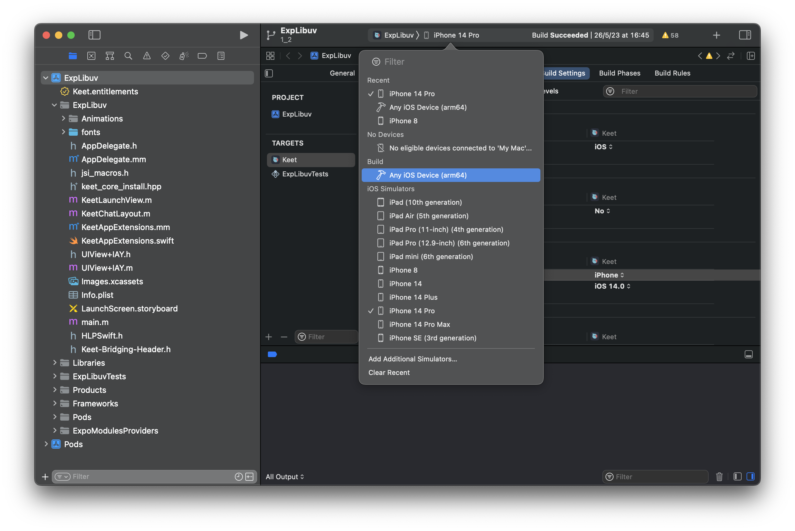

# Publish Keet to stores and github

## Overview

We can use Github action [Make a Build](https://github.com/holepunchto/keet-mobile/actions/workflows/build.yml) to build Android and iOS bundles for stores.

For iOS testflight and android apk:

1. Go [Make a Build](https://github.com/holepunchto/keet-mobile/actions/workflows/build.yml)
1. Under `Use workflow from`, Select related named branch (ex: `3.9`)
1. Under `Select platform to build`, Select `IOS-testflight-and-Android-apk`
1. Under `Select Flavour to build` select `prod`
1. uncheck the `Is debug release?` option

Then Github action will start build, after complete it will upload `.apk` to slack and upload the iOS bundle to testflight.

For Android store bundle:

1. Go [Make a Build](https://github.com/holepunchto/keet-mobile/actions/workflows/build.yml)
1. Under `Use workflow from`, Select related named branch (ex: `3.9`)
1. Under `Select platform to build`, Select `Android-aab`
1. Under `Select Flavour to build` select `prod`
1. uncheck the `Is debug release?` option

Them Github action will start build, after complete it will upload the `.aab`(Android bundle) file to slack.

## Apple (iOS)

For manual build iOS bundle, check the follow steps:

### Requirements

- Uploading from XCode or use [Apple Transporter](https://apps.apple.com/us/app/transporter/id1450874784?mt=12)

To build production build, switch project to local release config

```
sh scripts/ios_release.sh
```

### Procedure for publishing

- Remember to run `./scripts/version_increment.sh`
- Open `./ios/Keet.xcworkspace` (or through command `xed ios/Keet.xcworkspace`)
- From XCode's top bar, pick `Build > Any iOS Device (arm64)`



- From Menu, select `Product > Archive`
- If it shows an error regarding `EXConstants`, just go to the `EXConstants-EXConstants target > General` and select `Holepunch Inc` Team and retry `Archive`.


- When the Archives window appear, press `Distribute App` with the new created archive.
- `App Store Connect`
- `Export`
- `App Store Connect distribution options`: all checked
- `Automatically manage signing`
- `Export`

Now in Transporer app:

- Drag and drop the generated `.ipa` inside the archive folder on Transporter.
- Press `Deliver` and wait until

Now in the [App Store Connect](https://appstoreconnect.apple.com/apps/6443880549/testflight/ios):

- In the `TestFlight` tab you'll find a collapsible list with builds for each version. After a while of `(Processing)` state, it'll be in `Missing Compliance` 
- Click `Manage`
- In the `Export Compliance Information` modal pick `Standard encryption algorithms instead of, or in addition to, using or accessing the encryption within Apple's operating system` and then `Next`.
- For the question `Is your app going to be available on the App Store in France?` pick **No** and `Save`.

---

## Android

For manual build iOS bundle, check the follow steps:

### APK for internal testing

- **IMPORTANT:** `keet.keystore` must be in `android/app` folder.

Run `npm run android:release`

Or do it manually by go to the `android/` folder and run:

```sh
# advice: always clean before building to avoid cache problems
./gradlew clean && ./gradlew assembleInternalRelease
```

- Once done, APK will be in `app/build/outputs/apk/internal/release/app-internal-arm64-v8a-release.apk`

### APK for El-Salvador

Run `./scripts/setup-sv.sh`

Run `npm run android:release`

Or do it manually by go to the `android/` folder and run:

```sh
# advice: always clean before building to avoid cache problems
./gradlew clean && ./gradlew assembleSvRelease
```

- Once done, APK will be in `app/build/outputs/apk/sv/release/app-internal-arm64-v8a-release.apk`

### Bundle for Google Play Store

Run `npm run android:bundle`

Or from Android Studio, import the gradle project via `File > New > Import project...`, just pick the `android/` folder in the project root.

- Go to `Build > Generate Signed Bundle or APK`


- Pick `Android App Bundle`
- First time you'll need to choose where `keet.keystore` is and fill passwords and key alias. Once done, click `Next`
- Choose a `Destination folder` and pick `storeRelease` build variant, then `Create`
- Once finished a tooltip will appear, the bundle will be available under the destination folder you picked, in `store/release/app-store-release.aab`

## Upload store signed apk to github

We need download `Signed general APK` from play store, then host the APK on github release.

Once submitted `.aab` to play store:

1. go to the [App Explorer](https://play.google.com/console/u/0/developers/8938874293093237984/app/4975976021048504762/bundle-explorer-selector) section
2. select the target version (the right arrown might be hidden if screen is not wide enough)
3. switch to `Download Content` tab
4. download `Signed general APK`

Then visit the [keet-mobile-releases](https://github.com/holepunchto/keet-mobile-releases/releases) site, upload and follow previous versions to add release notes.

> [!Note]
> Save the release as `Draft` when store releases are not ready

Preserve the changelogs, Append the current version changelogs above the previous ones. Remove the logs which are not visible to user yet such as under flag or logs that are un-related to end user. Also update the changelog only after the release.

Could check [here](https://gra.caldis.me/?url=https://github.com/holepunchto/keet-mobile-releases) or [here](https://hanadigital.github.io/grev/?user=holepunchto&repo=keet-mobile-releases) to get the download counts for each releases.
